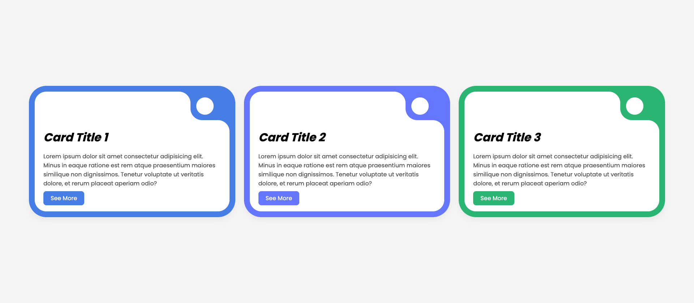

# 🌀 Inverted Border Radius

A modern card UI with a unique **inverted border radius** effect built using pure **CSS**, featuring smooth hover animations and responsive design. 🚀

---

## 🔍 **Live Demo**
🌍 [View Live](https://alifarhadi11.github.io/inverted-border-radius/)  

---

## 📸 **Preview**


---

## ⚙️ **Features**
- 🏗️ **Pure CSS** implementation — No external libraries
- 🎨 **Smooth hover animations**
- 📱 **Responsive design**
- 💡 **Modern and clean UI**

---

## 🚀 **How to Run Locally**
```bash
# Clone the repository
git clone https://github.com/AliFarhadi11/inverted-border-radius.git

# Navigate to the project folder
cd inverted-border-radius

# Just open the index.html file in your browser